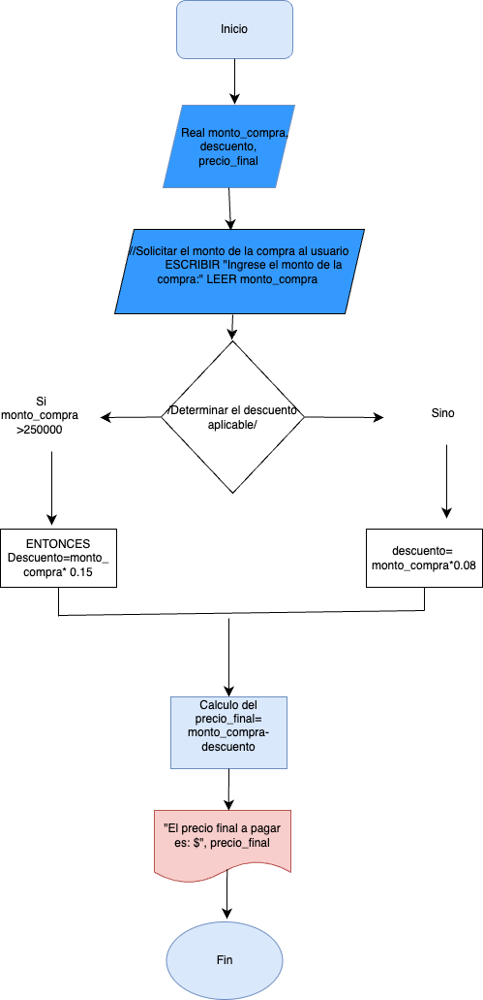
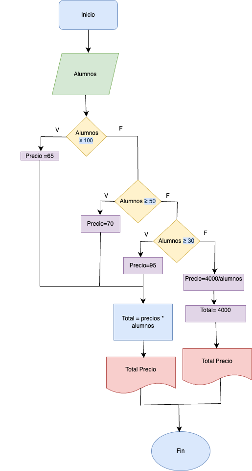

## Ejercicio 1.

Investiga cuáles son los símbolos que se utilizan para representar cada operación de un algorimo con un diagrama de flujo. Asegúrate de que la fuente es confiable, discute lo que encontraste con tus compañeros y con el profe. Cuando estés seguro/a de tener los símbolos correctos, consigna la información en la bitácora.

    Los diagramas de flujo son herramientas visuales que representan algoritmos o procesos mediante símbolos estandarizados. Cada símbolo tiene un significado específico y se utiliza para representar una acción, decisión, entrada, salida, o conexión dentro del flujo del proceso. A continuación, se presentan los símbolos más comunes utilizados en diagramas de flujo, basados en fuentes confiables y estándares internacionales:
---

    
<h4>1. Óvalo (Elipse)</h4>
<ul>
    <li><strong>Nombre:</strong> Inicio/Final.</li>
    <li><strong>Uso:</strong> Representa el inicio o el final de un proceso.</li>
    <li><strong>Descripción:</strong> Siempre se utiliza para indicar el punto de partida ("Inicio") o el punto de finalización ("Fin") del algoritmo.</li>
</ul>

<h4>2. Rectángulo</h4>
<ul>
    <li><strong>Nombre:</strong> Proceso.</li>
    <li><strong>Uso:</strong> Representa una acción o un paso en el proceso.</li>
    <li><strong>Descripción:</strong> Se utiliza para indicar operaciones como cálculos, asignaciones de variables, o cualquier acción que transforme datos.</li>
</ul>

<h4>3. Rombo</h4>
<ul>
    <li><strong>Nombre:</strong> Decisión.</li>
    <li><strong>Uso:</strong> Representa una condición o pregunta que requiere una respuesta binaria (Sí/No, Verdadero/Falso).</li>
    <li><strong>Descripción:</strong> Tiene una entrada y dos salidas, que representan los dos posibles caminos que puede tomar el flujo del proceso.</li>
</ul>

<h4>4. Flechas</h4>
<ul>
    <li><strong>Nombre:</strong> Conector de flujo.</li>
    <li><strong>Uso:</strong> Indica la dirección del flujo del proceso.</li>
    <li><strong>Descripción:</strong> Conectan los símbolos y muestran el orden en que se ejecutan las acciones.</li>
</ul>

<h4>5. Paralelogramo</h4>
<ul>
    <li><strong>Nombre:</strong> Entrada/Salida.</li>
    <li><strong>Uso:</strong> Representa la entrada de datos (por ejemplo, desde el usuario) o la salida de resultados (por ejemplo, mostrar información en pantalla).</li>
    <li><strong>Descripción:</strong> Se utiliza para operaciones de lectura o escritura de datos.</li>
</ul>

<h4>6. Círculo pequeño</h4>
<ul>
    <li><strong>Nombre:</strong> Conector.</li>
    <li><strong>Uso:</strong> Representa una conexión entre dos partes del diagrama de flujo, especialmente cuando el diagrama se divide en varias páginas o secciones.</li>
    <li><strong>Descripción:</strong> Se utiliza para evitar cruces de líneas y mantener la claridad del diagrama.</li>
</ul>

<h4>7. Rectángulo con líneas verticales</h4>
<ul>
    <li><strong>Nombre:</strong> Subproceso.</li>
    <li><strong>Uso:</strong> Representa un proceso

---

*Referencias bibliograficas:*
*International Organization for Standardization (ISO). (1985). ISO 5807: Information processing — Documentation symbols and conventions for data, program and system flowcharts, program network charts and system resources charts.*

*American National Standards Institute (ANSI). (1970). ANSI X3.5: Flowchart Symbols and Their Usage in Information Processing.*

*Cormen, T. H., Leiserson, C. E., Rivest, R. L., & Stein, C. (2009). Introduction to Algorithms (3rd ed.). MIT Press.*

 3.09.58 p.m..png>)

*Imagen obtenida de "Problemario de algoritmos resueltos con diagramas de flujo y pseudocodigo*

## Ejercicio 2 
Analicemos el siguiente problema y representemos su solución mediante un algoritmo secuencial.

- Construye un algoritmo que, al recibir como datos **el ID** del empleado y los seis primeros sueldos del año, calcule el ingreso total semestral y el promedio mensual, e imprima el ID del empleado, el ingreso total y el promedio mensual.

### Diagrama de Flujo 

 3.34.12 p.m..png>)

## EJERCICIOS 

1. Realice un algoritmo para determinar cuánto se debe pagar por equis cantidad de lápices considerando que si son 1000 o más el costo es de $85 cada uno; de lo contrario, el precio es de $90. Represéntelo con el pseudocódigo y el diagrama de flujo.

### Pseudocodigo

    INICIO

    // Declaración de variables
    ENTERO cantidad_lapices
    REAL costo_total

    // Solicitar la cantidad de lápices al usuario
    ESCRIBIR "Ingrese la cantidad de lápices:"
    LEER cantidad_lapices

    // Determinar el costo por lápiz
    SI cantidad_lapices >= 1000 ENTONCES
        costo_total = cantidad_lapices * 85
    SINO
        costo_total = cantidad_lapices * 90
    FIN SI

    // Mostrar el costo total
    ESCRIBIR "El costo total es: $", costo_total

FIN

#### DIAGRAMA DE FLUJO

2. Un almacén de ropa tiene una promoción: por compras superiores a $250 000 se les aplicará un descuento de 15%, de caso contrario, sólo se aplicará un 8% de descuento. Realice un algoritmo para determinar el precio final que debe pagar una persona por comprar en dicho almacén y de cuánto es el descuento que obtendrá. Represéntelo mediante el pseudocódigo y el diagrama de flujo.

### Pseudocodigo

    INICIO

    // Declaración de variables
    REAL monto_compra, descuento, precio_final

    // Solicitar el monto de la compra al usuario
    ESCRIBIR "Ingrese el monto de la compra:"
    LEER monto_compra

    // Determinar el descuento aplicable
    SI monto_compra > 250000 ENTONCES
        descuento = monto_compra * 0.15  // Descuento del 15%
    SINO
        descuento = monto_compra * 0.08  // Descuento del 8%
    FIN SI

    // Calcular el precio final
    precio_final = monto_compra - descuento

    // Mostrar resultados
    ESCRIBIR "El descuento aplicado es: $", descuento
    ESCRIBIR "El precio final a pagar es: $", precio_final

FIN

#### DIAGRAMA DE FLUJO

3. El director de una escuela está organizando un viaje de estudios, y requiere determinar cuánto debe cobrar a cada alumno y cuánto debe pagar a la compañía de viajes por el servicio. La forma de cobrar es la siguiente: si son 100 alumnos o más, el costo por cada alumno es de $65.00; de 50 a 99 alumnos, el costo es de $70.00, de 30 a 49, de $95.00, y si son menos de 30, el costo de la renta del autobús es de $4000.00, sin importar el número de alumnos.

## Pseudocodigo

    INICIO
    // Declaración de variables
    ENTERO num_alumnos
    REAL costo_por_alumno, costo_total

    // Solicitar el número de alumnos al usuario
    ESCRIBIR "Ingrese el número de alumnos:"
    LEER num_alumnos

    // Determinar el costo por alumno y el costo total
    SI num_alumnos >= 100 ENTONCES
        costo_por_alumno = 65.00
        costo_total = num_alumnos * costo_por_alumno
    SINO SI num_alumnos >= 50 ENTONCES
        costo_por_alumno = 70.00
        costo_total = num_alumnos * costo_por_alumno
    SINO SI num_alumnos >= 30 ENTONCES
        costo_por_alumno = 95.00
        costo_total = num_alumnos * costo_por_alumno
    SINO
        costo_por_alumno = 4000.00 / num_alumnos  // Costo fijo del autobús dividido entre los alumnos
        costo_total = 4000.00
    FIN SI

    // Mostrar resultados
    ESCRIBIR "El costo por alumno es: $", costo_por_alumno
    ESCRIBIR "El costo total a pagar a la compañía de viajes es: $", costo_total

FIN

#### Diagrama de Flujo 

## Ejercicio Convertido en formato para Python

# Declaración de variables
num_alumnos = 0
costo_por_alumno = 0.0
costo_total = 0.0

# Solicitar el número de alumnos al usuario
num_alumnos = int(input("Ingrese el número de alumnos: "))

# Determinar el costo por alumno y el costo total
if num_alumnos >= 100:
    costo_por_alumno = 65.00
    costo_total = num_alumnos * costo_por_alumno
elif num_alumnos >= 50:
    costo_por_alumno = 70.00
    costo_total = num_alumnos * costo_por_alumno
elif num_alumnos >= 30:
    costo_por_alumno = 95.00
    costo_total = num_alumnos * costo_por_alumno
else:
    costo_por_alumno = 4000.00 / num_alumnos  # Costo fijo del autobús dividido entre los alumnos
    costo_total = 4000.00

# Mostrar resultados
print(f"El costo por alumno es: ${costo_por_alumno:.2f}")
print(f"El costo total a pagar a la compañía de viajes es: ${costo_total:.2f}")

# Consigna tus respuestas en la bitácora

A continuación, se presentan enunciados relacionados con los temas tratados en el texto. Los estudiantes deben responder si los enunciados corresponden o no con las definiciones o conceptos aprendidos.

### Parte 1: Identificar Algoritmos

Responde si los siguientes enunciados representan un algoritmo. Justifica la respuesta:

1. **Una página web.**
   - **Respuesta:** No es un algoritmo.
   - **Justificación:** Una página web es un conjunto de elementos multimedia y texto organizados para ser visualizados en un navegador, pero no representa una secuencia de pasos para resolver un problema.

2. **Una receta para hacer un pastel, donde se indican ingredientes y pasos a seguir.**
   - **Respuesta:** Sí es un algoritmo.
   - **Justificación:** Una receta es una secuencia ordenada de pasos que deben seguirse para lograr un resultado específico (hacer un pastel), lo cual cumple con la definición de algoritmo.

3. **"Piensa en un número y multiplícalo por otro".**
   - **Respuesta:** No es un algoritmo.
   - **Justificación:** Esta instrucción es demasiado vaga y no especifica un conjunto de pasos claros y ordenados para resolver un problema.

4. **Un manual de instrucciones para armar un mueble, con pasos detallados y un orden claro.**
   - **Respuesta:** Sí es un algoritmo.
   - **Justificación:** El manual proporciona una secuencia de pasos detallados y ordenados para lograr un objetivo específico (armar un mueble), lo cual cumple con la definición de algoritmo.

5. **Una lista de compras organizada en orden alfabético.**
   - **Respuesta:** No es un algoritmo.
   - **Justificación:** Una lista de compras es simplemente una enumeración de elementos, no una secuencia de pasos para resolver un problema.

### Parte 2: Variables y Constantes

Indica si las siguientes afirmaciones describen una variable o una constante:

1   . **El valor de la gravedad en la Tierra, 9.8 m/s².**
   - **Respuesta:** Constante.
   - **Justificación:** El valor de la gravedad en la Tierra es un valor fijo y no cambia.

2.  **La edad de una persona calculada en base al año actual y su año de nacimiento.**
   - **Respuesta:** Variable.
   - **Justificación:** La edad de una persona cambia con el tiempo, por lo que es una variable.

3.  **La cantidad de dinero en una cuenta bancaria.**
   - **Respuesta:** Variable.
   - **Justificación:** La cantidad de dinero en una cuenta bancaria puede variar debido a depósitos, retiros y otros factores.

4.   **La velocidad de la luz en el vacío, 299,792,458 m/s.**
   - **Respuesta:** Constante.
   - **Justificación:** La velocidad de la luz en el vacío es un valor fijo y no cambia.

5. **El radio de un círculo.**
   - **Respuesta:** Variable.
   - **Justificación:** El radio de un círculo puede variar dependiendo del círculo específico que se esté considerando.

### Parte 3: Características de los Algoritmos

Responde si los siguientes enunciados cumplen con las características de un algoritmo. Justifica la respuesta:

1. **Para elegir la ruta más corta entre varias ciudades, el algoritmo examina rutas candidatas, deteniéndose cuando los cambios en la distancia parecen lo suficientemente pequeños.**
   - **Respuesta:** Sí cumple con las características de un algoritmo.
   - **Justificación:** El proceso descrito es sistemático, finito y tiene un objetivo claro (encontrar la ruta más corta), lo cual cumple con las características de un algoritmo.

2. **Suma los números ingresados y muestra el resultado.**
   - **Respuesta:** Sí cumple con las características de un algoritmo.
   - **Justificación:** La instrucción describe un proceso claro y finito para sumar números y mostrar el resultado, lo cual es una característica de un algoritmo.

3. **Un conjunto de pasos para calcular el área de un rectángulo dado su base y altura.**
   - **Respuesta:** Sí cumple con las características de un algoritmo.
   - **Justificación:** Los pasos para calcular el área de un rectángulo son claros, ordenados y finitos, lo cual cumple con las características de un algoritmo.

4. **El algoritmo cuenta el número de votos obtenidos por cada uno de los candidatos de una elección para presidente. Empieza solicitando el nombre del candidato y finaliza cuando se ingresa el valor -1.**
   - **Respuesta:** Sí cumple con las características de un algoritmo.
   - **Justificación:** El proceso descrito es sistemático, tiene un inicio y un fin claros, y sigue una secuencia de pasos para lograr un objetivo específico, lo cual cumple con las características de un algoritmo.

### Parte 4: Comprensión de Herramientas

Indica si las siguientes afirmaciones son ciertas o falsas respecto al pseudocódigo y diagramas de flujo:

1. **El pseudocódigo utiliza símbolos estándar para representar las operaciones lógicas.**
   - **Respuesta:** Falso.
   - **Justificación:** El pseudocódigo utiliza un lenguaje natural o cercano al lenguaje humano para describir los pasos de un algoritmo, no símbolos estándar.

2. **Los diagramas de flujo son una representación gráfica de un algoritmo.**
   - **Respuesta:** Verdadero.
   - **Justificación:** Los diagramas de flujo utilizan símbolos gráficos para representar los pasos de un algoritmo de manera visual.

3. **El pseudocódigo debe estar escrito en un lenguaje de programación específico.**
   - **Respuesta:** Falso.
   - **Justificación:** El pseudocódigo no está ligado a un lenguaje de programación específico, sino que es una descripción en lenguaje natural o cercano al lenguaje humano.

4. **Un diagrama de flujo siempre debe tener un inicio y un fin claramente definidos.**
   - **Respuesta:** Verdadero.
   - **Justificación:** Un diagrama de flujo debe tener un punto de inicio y un punto de fin claramente marcados para representar el comienzo y el final del proceso.

### Parte 5: Estructuras de Control

Describe para qué sirven las estructuras de control. Redacta dos ejemplos, uno de tu vida diaria, es decir cuando tienes que tomar decisiones en tus actividades diarias y oto ejemplo en el que se tengan que utilizar cálculos matemáticos para tomar una u otra decisión.

### Estructuras de Control

**Descripción:** Las estructuras de control son utilizadas en programación para dirigir el flujo de ejecución de un programa. Permiten tomar decisiones, repetir acciones y controlar el orden en que se ejecutan las instrucciones.

**Ejemplo 1: Vida diaria**
- **Situación:** Decidir qué ropa ponerse en función del clima.
- **Estructura de control:** Si está lloviendo, usar un impermeable; si hace sol, usar ropa ligera.
- **Explicación:** Aquí se utiliza una estructura de control condicional (si-entonces) para tomar una decisión basada en una condición (el clima).

**Ejemplo 2: Cálculos matemáticos**
- **Situación:** Determinar si un número es positivo, negativo o cero.
- **Estructura de control:** Si el número es mayor que 0, es positivo; si es menor que 0, es negativo; si es igual a 0, es cero.
- **Explicación:** En este caso, se utiliza una estructura de control condicional (si-entonces-si no) para tomar una decisión basada en el valor del número.